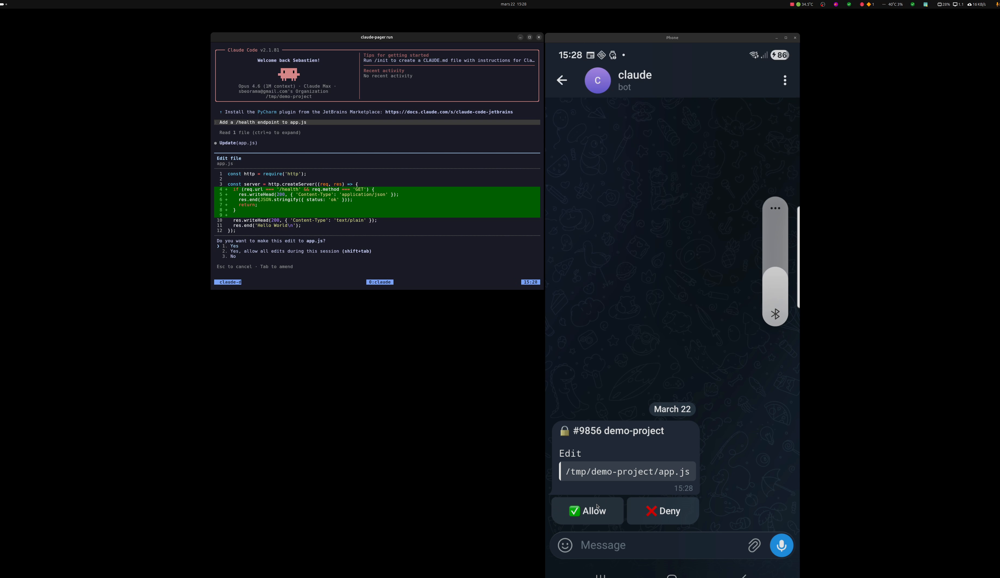
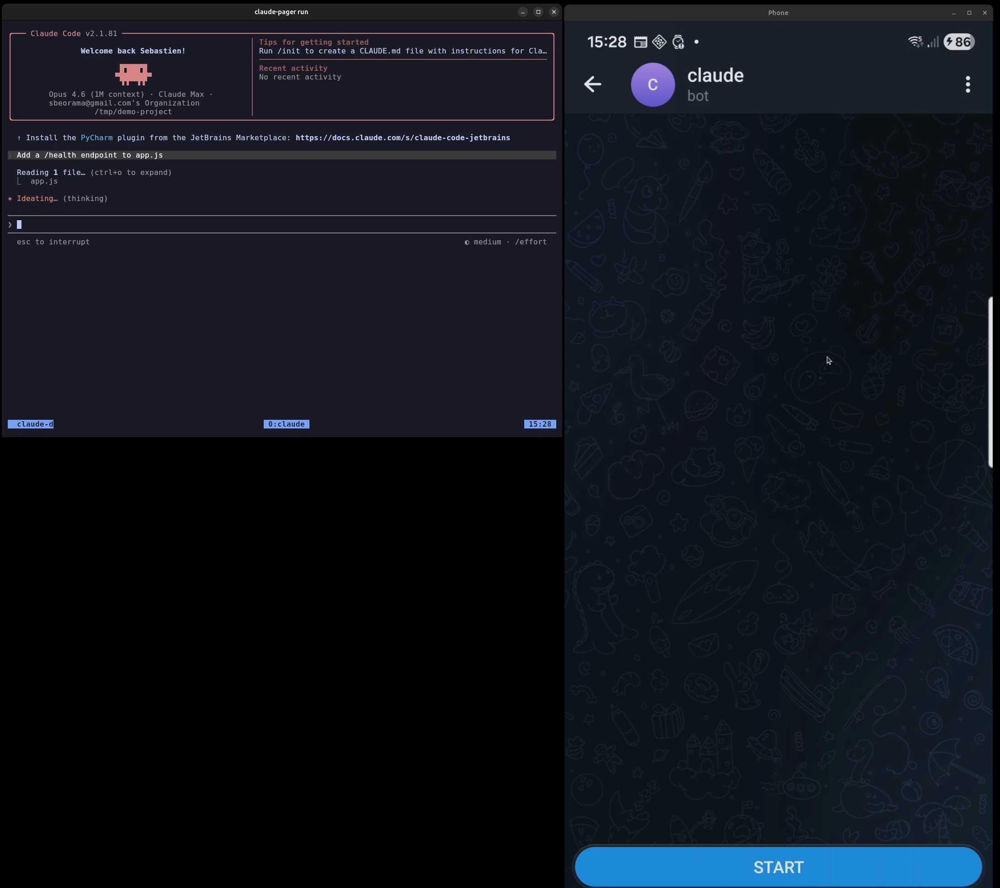
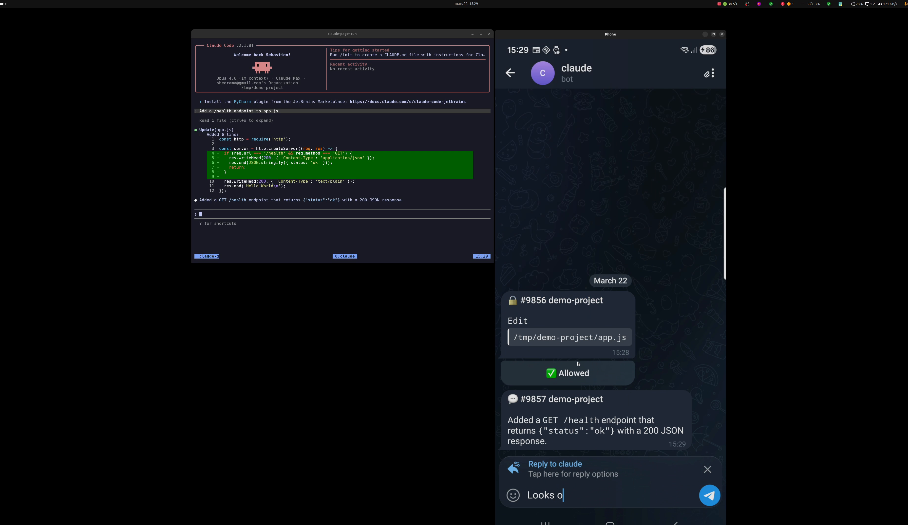
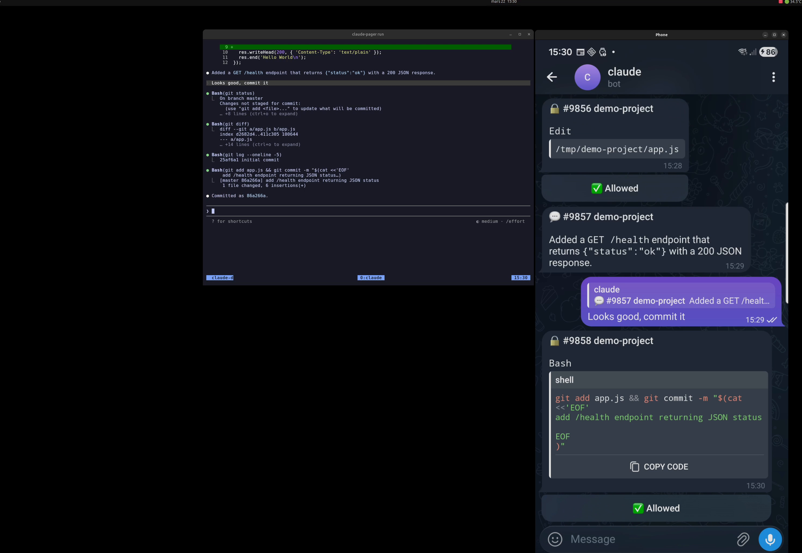

# claude-pager

[](https://www.npmjs.com/package/claude-pager)
[](https://www.npmjs.com/package/claude-pager)
[](https://github.com/sbassomp/claude-pager/blob/main/LICENSE)

Get paged on your phone when Claude Code needs input. Reply from Telegram or ntfy, and `claude-pager` types your response into the correct terminal.

[](https://youtu.be/lwUlf4eXAk4)

> Click the image above to watch the demo (~50s)

## How it works

1. Claude Code hooks fire when an instance needs user input
2. The hook enriches the event (tool name, last assistant message) and sends it to the daemon
3. The daemon dispatches a notification to your phone via Telegram or ntfy
4. You respond — tap Allow/Deny, type a message, or send a voice note
5. The daemon matches the response to the right session and injects it via `tmux send-keys`

| Step | Screenshot |
|------|-----------|
| Claude Code asks for permission |  |
| Notification arrives on your phone |  |
| You reply from Telegram |  |
| Claude resumes automatically |  |

## Features

- **Web dashboard** — live view of all sessions at `http://localhost:17380/dashboard`, with Allow/Deny buttons, text replies, CI/CD status, and git info
- **Multi-session** — run N Claude Code instances in tmux, responses route to the correct pane
- **Telegram** — inline keyboards (Allow/Deny), reply-to-message routing, voice transcription (Whisper)
- **ntfy** — self-hosted or ntfy.sh, mobile push notifications
- **CI/CD integration** — GitLab and GitHub pipeline status per project (main/staging)
- **Smart tmux titles** — terminal tabs auto-update with the current session topic
- **Session recovery** — `claude-pager recover` detects existing Claude sessions in tmux
- **Smart routing** — `#id response` for explicit targeting, auto-route for single session, session picker for ambiguous cases
- **Fallback by project** — if a session UUID is no longer registered, matches by `cwd` (project directory)

## Requirements

- Node.js >= 20
- tmux
- Linux (macOS support planned)
- A Telegram bot or ntfy server for notifications

## Installation

```bash
npm install -g claude-pager
```

## Setup

Interactive configuration — creates `~/.claude-pager/config.json` and installs Claude Code hooks in `~/.claude/settings.json`:

```bash
claude-pager setup
```

The setup wizard lets you choose between **Telegram** and **ntfy** as notification channel, and verifies the connection.

### Telegram

You need a Telegram bot token (from [@BotFather](https://t.me/BotFather)) and a chat ID. The setup command walks you through obtaining both.

### ntfy

Point to your ntfy server (self-hosted or `https://ntfy.sh`) with a topic and optional authentication (user/password or token).

## Usage

### Start the daemon

```bash
# Foreground (for testing)
claude-pager start

# As a systemd user service (recommended)
cat > ~/.config/systemd/user/claude-pager.service << 'EOF'
[Unit]
Description=Claude Code Relay Daemon
After=network-online.target
Wants=network-online.target

[Service]
Type=simple
ExecStart=%h/.local/bin/claude-pager start
ExecStop=%h/.local/bin/claude-pager stop
Restart=on-failure
RestartSec=5
Environment=NODE_ENV=production

[Install]
WantedBy=default.target
EOF
# If claude-pager is installed via nvm, adjust ExecStart path:
#   ExecStart=/home/you/.nvm/versions/node/v22.x.x/bin/claude-pager start
systemctl --user daemon-reload
systemctl --user enable --now claude-pager
```

### Launch Claude Code in tmux

```bash
claude-pager run              # opens a new tmux session with claude
claude-pager run --resume     # pass args through to claude
```

Or just run `claude` directly inside tmux — the `SessionStart` hook registers the session automatically.

### Recover existing sessions

If you already have Claude Code running in tmux panes:

```bash
claude-pager recover
```

### Other commands

```bash
claude-pager status           # daemon status + health check
claude-pager pending          # list pending questions
claude-pager stop             # stop the daemon
```

## Responding to notifications

### Telegram

- **Permission prompts** — tap the inline **Allow** or **Deny** button
- **Idle prompts** — reply to the notification message with your answer
- **Voice** — send a voice message, it gets transcribed and injected
- **Free messages** — send a message without replying; if one session is active it goes there, otherwise a session picker appears

### ntfy

- Reply with `#<id> <response>` to target a specific notification
- If only one question is pending, any reply routes to it
- `allow` / `deny` auto-route to the most recent permission prompt

## Web Dashboard

Open `http://127.0.0.1:17380/dashboard` in your browser. The dashboard shows:

- All active sessions grouped by project
- **Allow/Deny buttons** for permission prompts — respond without switching to Telegram
- **Text input** for idle sessions — send a message directly to any Claude instance
- **CI/CD pipeline status** per project (GitLab / GitHub Actions)
- **Git status** — branch, modified files, unpushed commits, committed/pushed flags
- **"Needs Testing"** badge when CI fails or code is unpushed
- **Pin projects** to lock their dashboard position
- **Expandable titles** — click "..." to see the full message
- **Dismiss button** (🗑) to remove stale sessions
- Auto-refresh every 2 seconds
- tmux tab titles auto-update with the current session topic

> **Note:** Claude Code serializes permission prompts — each sub-agent waits for its response before the next one asks, even when running in parallel. To skip permission prompts for specific tools, configure `permissions.allow` in `~/.claude/settings.json`.

## Configuration

`~/.claude-pager/config.json`:

```json
{
  "port": 17380,
  "channel": {
    "type": "telegram",
    "telegram": {
      "botToken": "123456:ABC...",
      "chatId": 12345678
    }
  },
  "injector": "auto"
}
```

| Key | Default | Description |
|-----|---------|-------------|
| `port` | `17380` | Daemon HTTP port (localhost only) |
| `channel.type` | `"ntfy"` | `"ntfy"` or `"telegram"` |
| `injector` | `"auto"` | `"auto"`, `"tmux"`, or `"xdotool"` |
| `ci.type` | — | `"gitlab"` or `"github"` (optional) |
| `ci.gitlab.url` | — | GitLab server URL |
| `ci.gitlab.token` | — | Personal access token (scope: `read_api`) |
| `ci.github.token` | — | Personal access token (scope: `actions:read`) |

The hook port can be overridden with `CLAUDE_PAGER_PORT` environment variable.

## Architecture

Strategy + Factory pattern for pluggable components:

```
src/
├── channels/          # Notification channels (ntfy, telegram)
│   ├── channel.ts     # ChannelProvider interface
│   └── factory.ts
├── injectors/         # Terminal input injection (tmux, xdotool)
│   ├── injector.ts    # InputInjector interface
│   └── factory.ts
├── daemon/            # HTTP server + response routing
│   ├── server.ts      # Fastify routes with JSON Schema validation
│   └── handlers.ts    # Channel listener logic (routing, picker)
├── dashboard/         # Web dashboard (enricher, transcript, git, CI, HTML)
├── sessions/          # Session tracking + pending question store
├── hooks/             # Claude Code hook entry point
├── utils/             # Shared utilities (html, json, validation)
├── cli/               # Commander CLI
└── voice/             # Telegram voice transcription (Whisper)
```

See `docs/ARCHITECTURE.md` for the detailed flow.

## Security

- HTTP API binds to `127.0.0.1` only — no network exposure
- Input validation with Fastify JSON Schema + custom validators (`isValidEventType`, `isValidSessionId`)
- No shell injection — all child processes use `execFileSync` with argument arrays
- Minimal context in notifications — tool names, project names, and truncated tool input (max 300 chars)
- Memory-bounded maps (capped at 500-1000 entries)
- Safe JSON parsing with fallbacks for corrupted files

## Development

```bash
npm run build          # TypeScript compilation
npm test               # Run all tests (node:test)
npm run lint           # ESLint with typescript-eslint
npm run dev            # Dev mode (tsx watch)
```

## License

MIT
